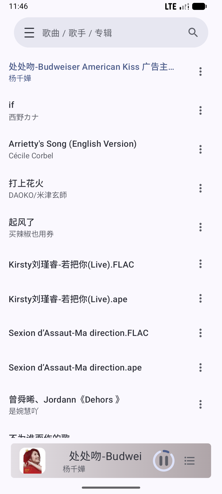
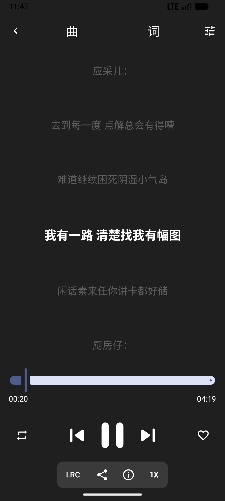
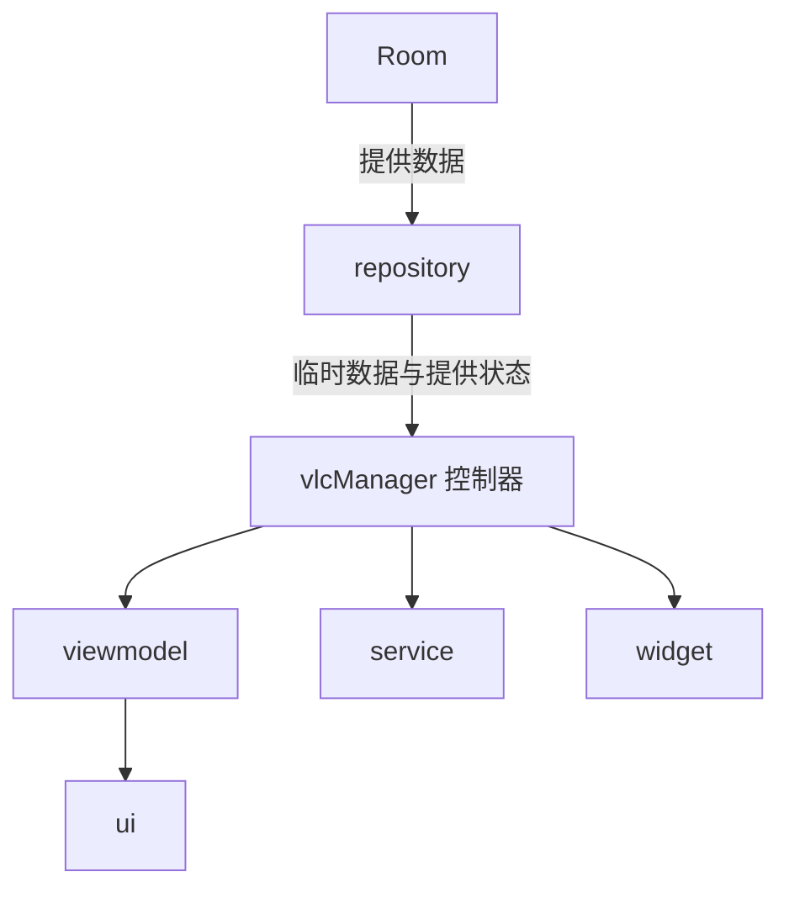

# Audio

一款基于 jetpack compose 、借助 vlc player 插件开发的几乎适配全格式音频的音乐软件

## 功能特性

- **基本功能**: 音频播放与搜索、音频列表、扫描文件、定时器、自选主题
- **本地缓存**: 使用 Room 数据库记忆扫描位置
- **后台服务与小部件**: 基本通知栏音乐服务与桌面小部件

## 运行截图

| 首页 | 扫描 | 播放页 |
| --- | --- |--- |
|  |  | |

## 技术栈



本项目采用现代 Android 开发规范和主流架构

**开发语言**: [kotlin](https://kotlinlang.org/)

**UI**: jetpack compose

**架构模式**: MVVM

**本地存储**: Room

this project uses libvlc-android licensed under the LGPLv2.1 or later. 

## 快速开始

### 运行环境

- android studio、jdk 21、gradle9.3.1

### 本地编译步骤

1. 克隆项目到本地

2. 使用 android studio 打开项目

3. 本项目使用了APi key 请在 local.properties 文件配置

4. Run ▷

## 开源协议

```text
Copyright [2026] [pointchange]

Licensed under the Apache License, Version 2.0 (the "License");
you may not use this file except in compliance with the License
You may obtain a copy of the License at

http://www.apache.org/licenses/LICENSE-2.0
```
